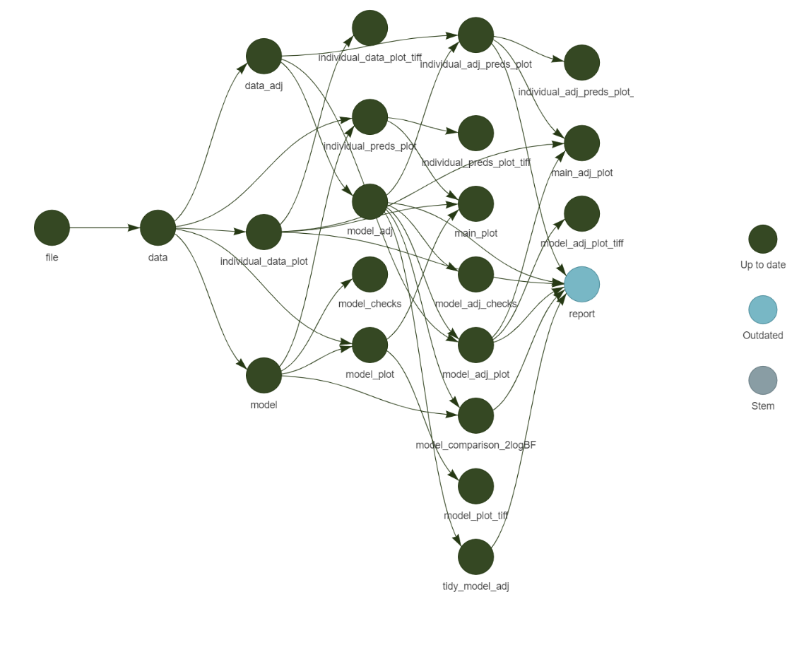

# Zelemiq lactate sensor pilot
A study piloting a new transdermal sensor (Zelemiq) for tracking changes in blood lactate and exploring the relationship with capillary blood samples analysed using the Biosen C-Line.

## Reproducibility

This project uses
[`renv`](https://rstudio.github.io/renv/articles/renv.html#reproducibility):

- `renv::snapshot()` save state
- `renv::restore()` load state

where state refers to package versions used by the project.

## Targets analysis pipeline

This project also uses a function based analysis pipeline using
[`targets`](https://books.ropensci.org/targets/)

Useful console functions:

- `tar_edit()` opens a the make file
- `tar_make()` to run targets
- `tar_visnetwork()` to view pipeline

The current targets in the pipeline are:

